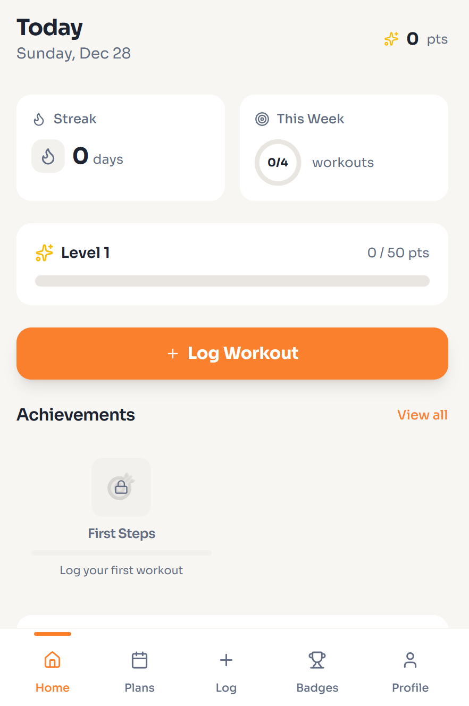
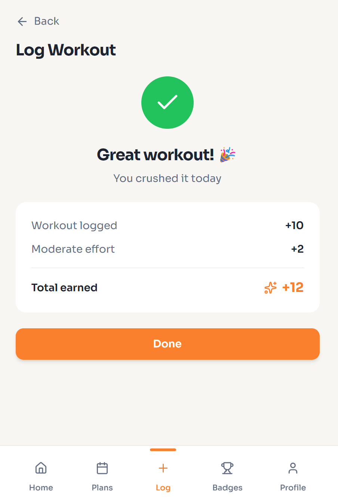
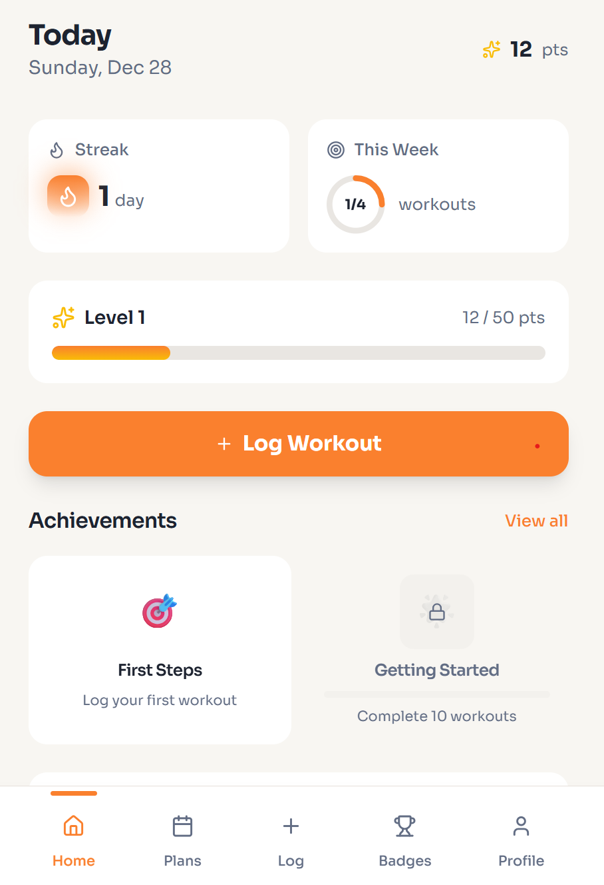

# Trackr - Gamifying your workouts

A mobile-first fitness tracking app designed to build consistency through gamification.  
Users log workouts, earn points, maintain streaks, and unlock badges to stay motivated while training for races or general fitness.

### Features
- Quick workout logging with instant feedback
- Points, streaks, and achievement-based badge system
- Weekly goals and progress tracking
- Clean, interaction-focused UI with subtle animations

### Tech Stack
- React / TypeScript
- Tailwind CSS
- Framer Motion

  
  
  

